# Factory Training Flow · 원익 HR Data & AI 프로젝트

공고의 **교육 분야 AI 과제 발굴·LLM 자동화 도입·HR 데이터 정제** 업무를 위해, 공정 시뮬레이션과 근거 기반 교육계획 검토를 연결한 개인 데모입니다. 기존 n8n 버전과 Line Lens 기반 확장을 함께 보관합니다.

## 최신 포트폴리오 · 2026.10.10

**공장 관찰 → 같은 교육 요청의 AI·규정 검토 → 담당자 승인·저장과 예외 비교**를 3페이지로 설명합니다. 합성 작업자 **SYN-101 / 자재 투입 기초(C-LOAD) / 2시간** 요청이 모든 장에서 이어집니다.

[3페이지 PDF](docs/portfolio.pdf) · [1장](docs/portfolio-page-1.png) · [2장](docs/portfolio-page-2.png) · [3장](docs/portfolio-page-3.png) · [편집 원본과 검수](docs/portfolio-source-v2/README.md)

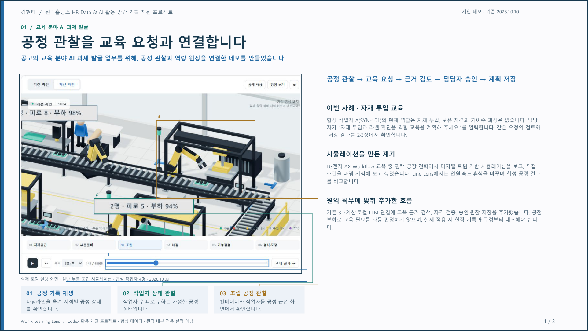

<details>
<summary>2·3장 보기 — 같은 요청의 검토·저장과 실제 예외 처리 결과</summary>

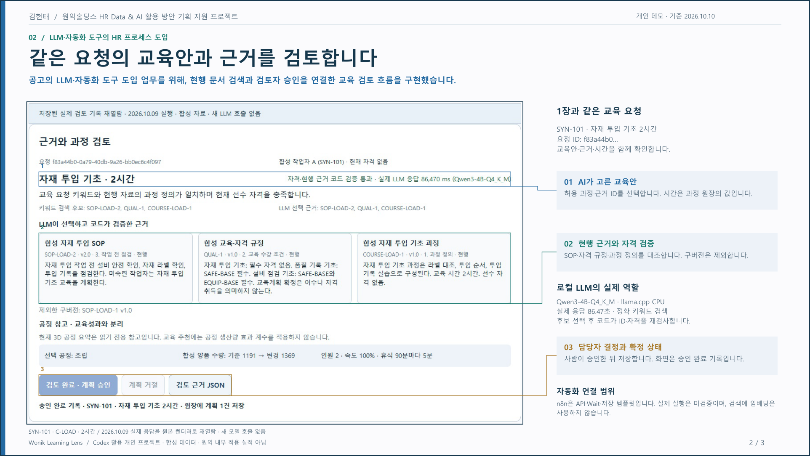

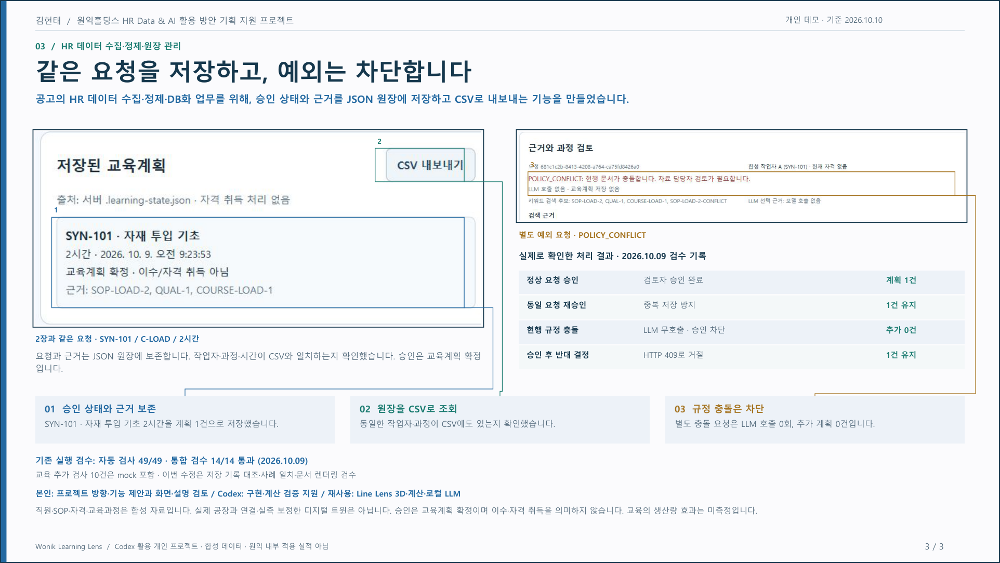

</details>

2장의 **86.47초**는 2026.10.09 해당 요청의 실제 로컬 모델 응답 시간입니다. 화면은 저장된 응답을 앱의 원본 렌더러로 재열람한 기록이며 새 모델 실행이나 승인 대기 화면으로 표현하지 않습니다. 3장의 비교 결과도 기존 실제 검수 기록입니다. 모든 화면에 외곽 네 변 테두리를 표시하고, 설명 대상은 얇은 사각형과 연결선으로 구분했습니다.

## 두 구현의 차이와 실행 위치

| 항목 | 최신 교육 근거 검토 확장 | 기존 n8n 공정 비교 버전 |
|---|---|---|
| 코드 위치 | [wonik-learning-lens/](wonik-learning-lens/README.md) | 저장소 루트·`simulator/`·`web/` |
| 핵심 과업 | 현행 문서와 자격을 확인한 교육안 검토·승인 원장 | 공정 대안 비교·n8n Wait·결정 기록 |
| 실제 로컬 LLM | Qwen3-4B-Q4_K_M / llama.cpp | Qwen2.5-1.5B-Instruct / Transformers |
| 계산·저장 | seed 공정 계산 / JSON 원장·CSV | SimPy / SQLite |
| 문서 검색 | 현행 필터 + 정확 키워드 매칭, 임베딩 미사용 | RAG 구현 없음 |
| n8n 검증 | API·Wait·저장 **미실행 템플릿** | 실제 n8n 실행 3건·모델 요청 2건 기록 |
| 교육 성과 | 계획만 저장, 이수·자격 부여 및 생산량 효과 미측정 | 검사 교육 효과는 사전 정의한 합성 가정 |

**두 버전의 모델·실행 증거·교육 효과 가정을 합산하지 않습니다.** 최신 포트폴리오는 왼쪽의 교육 근거 검토 확장을 설명합니다. 원익 내부 시스템·실제 직원 자료·현장 성과가 아니며, 실제 공장과 연결·실측 보정한 디지털 트윈 구축 경력으로 제시하지 않습니다.

최신 확장 실행:

```powershell
git clone https://github.com/Kimhyuntae9665/factory-training-flow.git
cd factory-training-flow/wonik-learning-lens
$env:PORT = '8786'
$env:LINE_LENS_LLM_URL = 'http://127.0.0.1:8787/v1'
npm start
```

Node.js 22 이상을 권장하며 npm 외부 의존성 설치 없이 실행합니다. [http://127.0.0.1:8786](http://127.0.0.1:8786)을 열고, AI 검토에는 별도의 llama.cpp·Qwen3 GGUF가 필요합니다. [상세 실행·사용 순서](wonik-learning-lens/README.md), [교육 API](wonik-learning-lens/docs/learning-api.md), [로컬 AI 설정](wonik-learning-lens/docs/local-ai-setup.md)을 확인하세요.

## 최신 확장의 실제 화면

### 공정 관찰

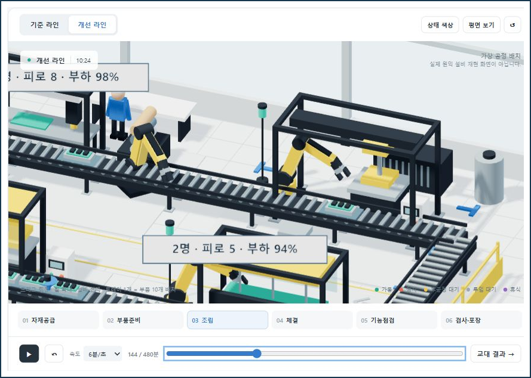

*2026.10.09 실제 실행 캡처입니다. 공정 부하를 교육 필요의 자동 진단이나 실제 교육 효과로 해석하지 않습니다.*

### 같은 요청의 교육안·근거 검토

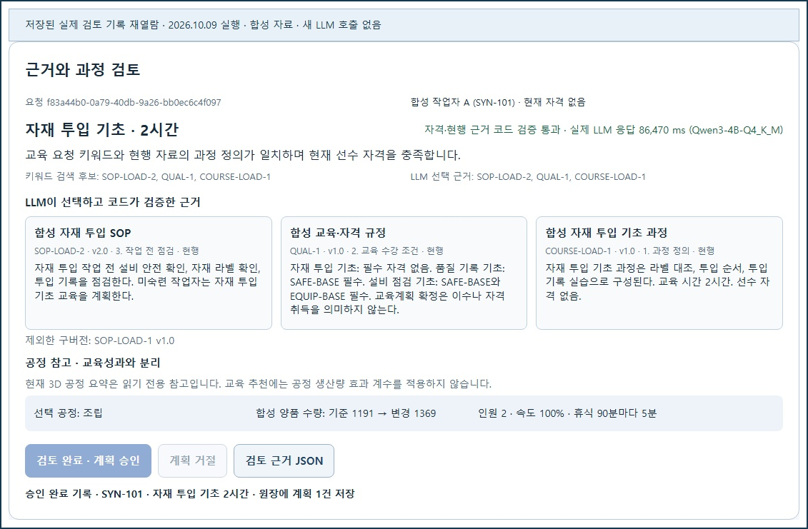

*현행 SOP·자격 규정·과정 정의를 검색하고, 실제 모델이 선택한 ID를 코드로 검사했습니다. 저장된 승인 완료 기록을 2026.10.10 재열람했으며 새 모델 호출은 없습니다.*

### 승인 원장과 차단 결과

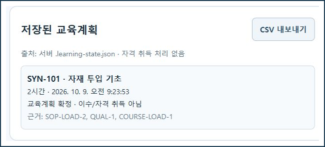

*SYN-101 / C-LOAD / 2시간 계획 1건입니다. JSON 원장과 CSV에서 동일 요청·작업자·과정·시간을 대조했습니다. 근거 ID는 JSON 원장에 보존합니다.*

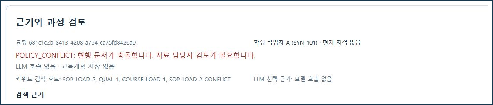

*별도 충돌 요청은 LLM을 호출하지 않고 승인을 차단했으며 추가 계획은 0건입니다. 정상 사례와 서로 다른 요청임을 구분합니다.*

### 실제 검증 결과

| 사례 | 실제 확인 결과 | 계획 저장 |
|---|---|---|
| 정상 요청 승인 | 담당자가 승인 | 1건 |
| 동일 요청 재승인 | 중복 저장 방지 | 1건 유지 |
| 현행 규정 충돌 | LLM 무호출·승인 차단 | 추가 0건 |
| 승인 후 반대 결정 | HTTP 409 | 1건 유지 |

2026.10.09의 기존 검수는 **자동 검사 49/49(교육 추가 10건은 mock 포함), 통합 검수 14/14**입니다. 이번 포트폴리오 개편에서는 사례·시간·원장·CSV를 대조하고 3장 전체/100% 렌더링을 검수했습니다. 새 LLM·n8n 실행을 수행한 것으로 합산하지 않습니다. [실행 증거](wonik-learning-lens/evidence/live-validation.json), [포트폴리오 검수](docs/portfolio-source-v2/validation.md), [스크린샷 출처·해시](docs/screenshots/wonik-learning-lens/manifest.json)를 제공합니다.

2026.10.10 GitHub 게시 준비에서는 복사한 `wonik-learning-lens` 소스의 자동 검사 **49/49를 다시 통과**했습니다. 별도 모델 추론·n8n 실행·14건 통합 검수는 재실행하지 않았습니다.

## 제작 계기와 기여

LG전자 AX Workflow 교육 중 평택 공장 견학에서 디지털 트윈 기반 공장 시뮬레이션을 보고 직접 조건을 바꿔 시험해 보고 싶었습니다. 기존 Line Lens의 3D 화면·인원/속도/휴식 계산·로컬 LLM 연결을 재사용하고 원익 공고의 교육 업무를 위한 검색·검증·승인·원장 기능을 추가했습니다.

본인은 방향·기능 제안과 화면·설명 검토를 맡았고, 구현·계산 검증에는 Codex의 지원을 받았습니다. [재사용과 추가 범위](wonik-learning-lens/docs/reuse-and-scope.md)를 구분했습니다. 교육의 실제 이수·자격 취득이나 현장 생산 개선 성과를 주장하지 않습니다.

---

## 기존 Factory Training Flow · n8n 실행 버전

아래는 이전 n8n·SimPy 구현의 실행 안내와 검증입니다. 최신 교육 근거 검토 확장의 실행 명령과 구분하세요. [이전 포트폴리오](docs/archive/factory-training-flow-20261008/portfolio.pdf), [기존 편집 원본](docs/portfolio-source/README.md)은 보존했습니다.

자연어 요청을 실제 Qwen2.5-1.5B-Instruct로 해석하고 SimPy로 공정 대안을 계산한 뒤 n8n Wait에서 검토 결정을 기다립니다. 결정과 계산 근거는 SQLite에 저장하고 같은 요청의 timeline을 Three.js로 재생합니다. 공고의 교육 분야 AI 과제 발굴 업무를 위해 합성 작업자의 검사 역량과 교육 대안을 비교·검토하는 개인 PoC입니다.

## 먼저 보고 싶은 분께

| 목적 | 바로 보기 |
|---|---|
| 전체 흐름 이해 | [구조와 역할](#구조와-역할) |
| 실제 화면 확인 | [실제 실행 화면 7장](#실제-실행-화면-7장) |
| 내 PC에서 실행 | [Windows 빠른 시작](#windows-빠른-시작) |
| AI의 역할 확인 | [LLM이 하는 일](#llm이-하는-일) · [실제 실행 증거](evidence/e2e-results.json) |
| n8n 워크플로 가져오기 | [workflow.json](workflow.json) · [노드 설명](#n8n-워크플로-10개-노드) |
| 수치와 한계 확인 | [비교 결과](#합성-공정-비교-결과) · [검증 범위](#검증-범위) |
| 이전 n8n 포트폴리오 | [보관한 3페이지 PDF](docs/archive/factory-training-flow-20261008/portfolio.pdf) |
| API 사용 | [API 문서](docs/API.md) |

## 해결하려는 문제

생산 병목을 확인해도 “로봇을 넣을지, 검사 인력을 교육할지, 둘을 함께 적용할지”는 다른 판단입니다. 계산 결과를 본 사람이 검토하고, 왜 승인하거나 거절했는지 남기는 과정도 필요합니다.

이 프로젝트는 그 과정을 작은 범위에서 연결합니다.

1. **움직이는 공장과 문제:** 조립·검사·이송을 갖춘 합성 공정에서 대기와 병목을 비교합니다.
2. **AI가 대안을 선택하는 흐름:** 실제 Qwen이 자연어 선호를 읽고 제한된 대안 라벨을 선택합니다. 계산 엔진이 같은 조건으로 비교합니다.
3. **비교 결과와 검증:** n8n이 검토 대기를 유지하고 결정 후에만 계획을 확정합니다. 중복 요청·반대 결정·잘못된 원장도 확인합니다.

교육은 미리 정한 적격 후보 1명의 검사 자격을 확보한다는 합성 가정입니다. 실제 직원의 평가·채용·교육 자격을 AI가 결정하는 시스템은 구현하지 않았습니다.

## 구조와 역할

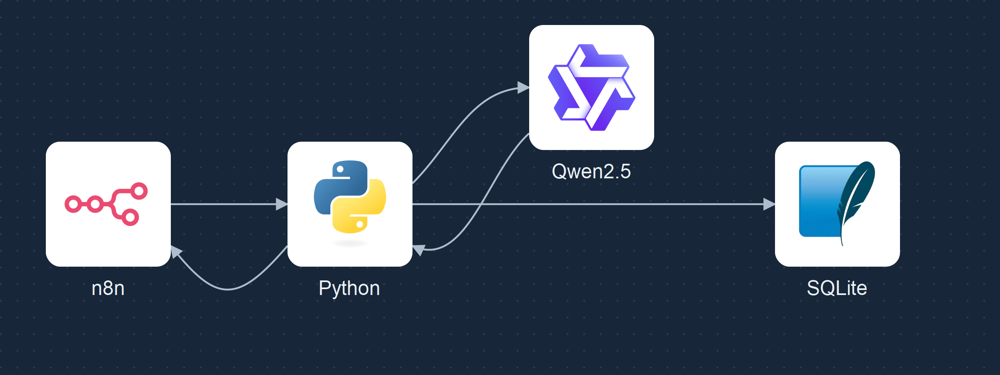

*기술 로고를 사용한 구조도입니다. 실제 n8n 에디터 화면 캡처와는 구분됩니다. 3D 뷰어는 저장된 계산 결과를 읽습니다.*

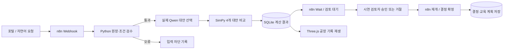

| 구성 | 맡은 일 | 주요 파일 |
|---|---|---|
| n8n 2.42.3 | 접수, 분기, 검토 대기, 결정 후 확정 HTTP 재시도 | [workflow.json](workflow.json) |
| Python 연결부 | 입력·상태 검증, 내부 API, 결정 영속화, SQLite 기록 | [adapter.py](adapter.py) |
| Qwen2.5-1.5B-Instruct | 자연어 선호를 제한된 대안 라벨로 분류 | [planner.py](simulator/planner.py) |
| SimPy 4.1.1 | 같은 주문과 seed로 공정 수치 계산 | [engine.py](simulator/engine.py) |
| 합성 역량 원장 | 4명의 검사 자격·교육 적격 조건 검수 | [workforce.json](simulator/data/workforce.json) · [workforce.py](simulator/workforce.py) |
| SQLite | 요청, 사건 이력, 결과, 결정, 교육 계획 저장 | 실행 시 `data/jobs.sqlite3` 생성 |
| Three.js | 저장된 seed 0 timeline을 공장으로 재생 | [replay.js](web/replay.js) · [factory-view.js](web/factory-view.js) |

### n8n을 결합한 이유

공장 시뮬레이터는 대안별 결과를 계산하고 재생합니다. n8n은 계산 앞뒤의 **업무 흐름**을 실행합니다. 결과가 나왔다고 바로 교육 계획을 만들지 않고, Wait 노드에서 대기한 뒤 검토 결정을 받아 확정합니다.

가져올 수 있는 실제 워크플로 JSON과 실제 실행 증거를 포함했습니다. n8n의 네이티브 AI Agent 노드를 사용하지는 않았습니다. HTTP Request 노드가 로컬 Python을 호출하고 Python이 실제 Qwen을 실행합니다.

### LLM이 하는 일

모델은 요청과 후보 설명을 읽고 `baseline`, `robot`, `training`, `combined` 중 선호 라벨을 선택합니다. CPU의 제한된 후보 점수를 중립 프롬프트와 보정하는 방식입니다.

- 실제 모델 추론을 사용합니다. 새 연결부에서 모델 실패를 규칙 기반 성공으로 대체하지 않습니다.
- 수요 배수·금지 조건은 별도 명시적 파서로 검증합니다.
- 공정 수치와 교육 효과는 LLM이 생성하지 않습니다. SimPy의 합성 가정과 계산 결과입니다.
- 결과 설명은 계산값을 넣은 **정형 요약**입니다. LLM이 자유롭게 생성한 보고서 문장이 아닙니다.
- 파인튜닝, RAG, 자율 설비 제어, 자유로운 대안 생성은 구현 범위에 포함하지 않습니다.

LLM의 **선호 라벨**과 계산 엔진의 **추천 대안**은 별도 값입니다. 엔진은 비교한 대안 중 평균 완료 수가 가장 큰 대안을 추천하고, 동률이면 완료 작업의 평균 리드타임을 비교합니다. 비용·안전·투자수익을 최적화하는 기준은 아닙니다. 기본 시연은 4개 대안을 비교하며 명시적 금지 조건이 있으면 비교 대상이 줄어들 수 있습니다.

모델: `Qwen/Qwen2.5-1.5B-Instruct`  
고정 revision: `989aa7980e4cf806f80c7fef2b1adb7bc71aa306`  
검증 실행: CPU / `torch.float32`. 모델 파일은 저장소에 포함하지 않습니다.

## 실제 실행 화면 7장

로컬에서 동작하는 앱을 캡처했습니다. 이미지 바깥 네 변에 연속 테두리를 넣고 UI의 수치·경고·기준일을 유지했습니다. 승인 대기 화면은 최초 검증 당시 캡처이고 나머지는 같은 완료 기록을 다시 열어 캡처했습니다. 목록은 [screenshots.json](docs/screenshots.json)에 있습니다.

### 1. n8n 검토 대기

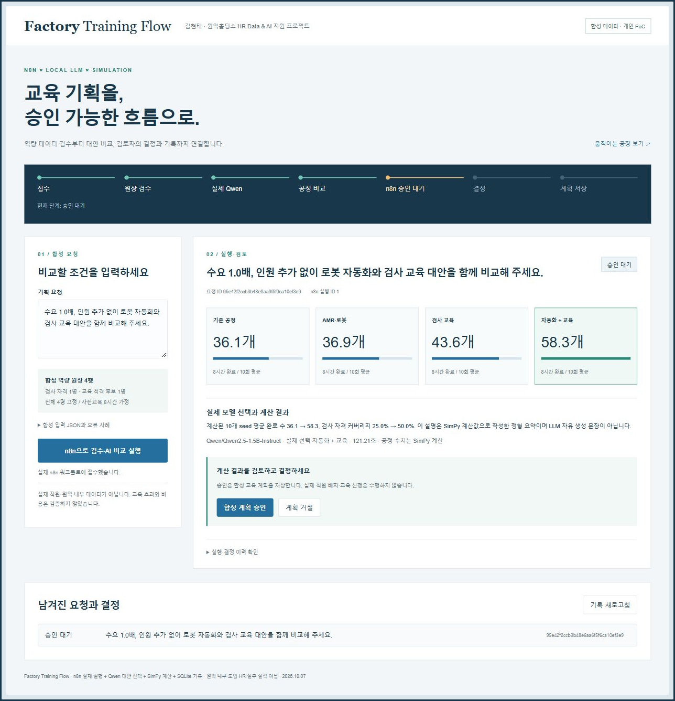

*실제 Qwen·SimPy 결과가 나와도 승인 전 교육 계획은 0건입니다. 당시의 대기 화면이며 신규 설치에 이 실행 DB가 들어가지는 않습니다.*

### 2. 승인 후 교육 계획 1건

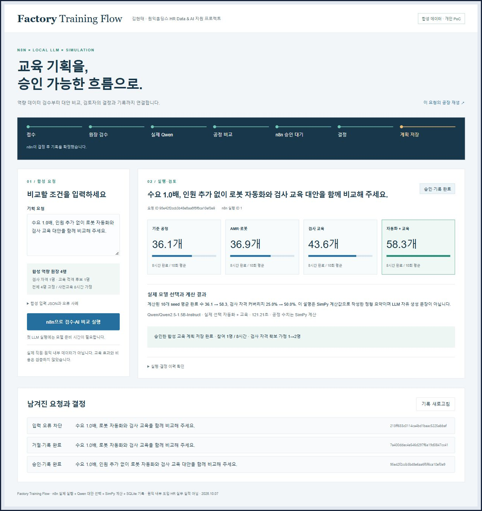

*참여 1명, 사전교육 8시간, 검사 자격 1→2명 가정. 요청 ID와 n8n 실행 ID로 기록을 연결합니다.*

### 3. 거절 후 교육 계획 0건

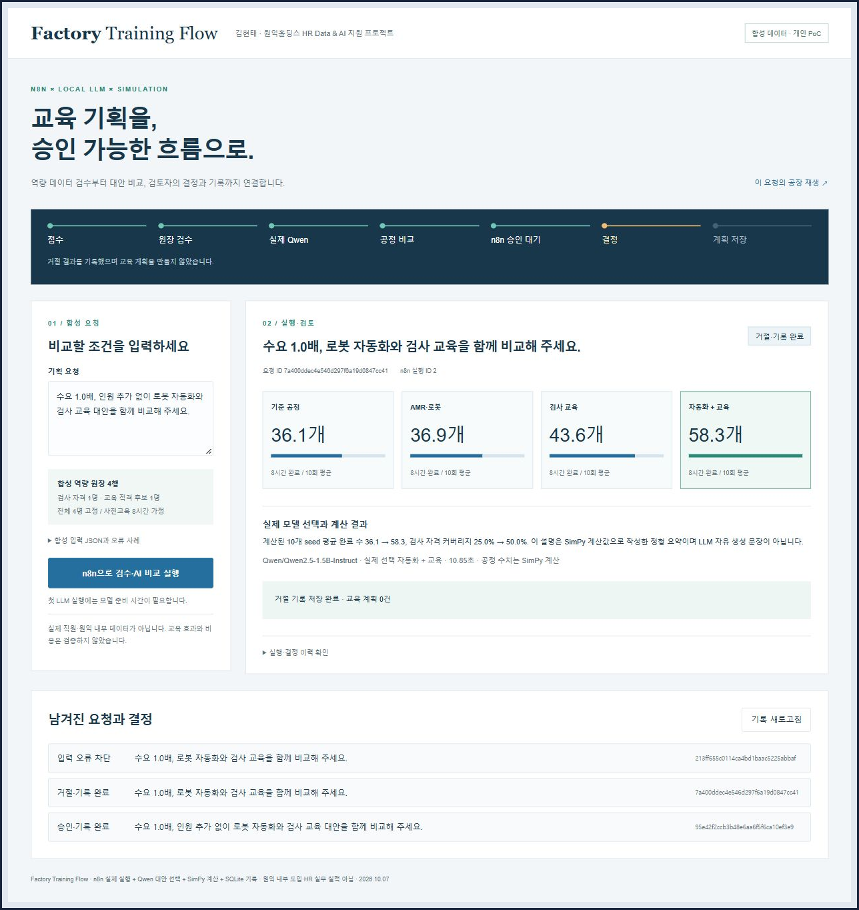

*계산 결과와 거절 결정을 보존합니다. 승인하지 않은 계획을 생성하지 않습니다.*

### 4. 잘못된 원장은 모델 실행 전에 차단

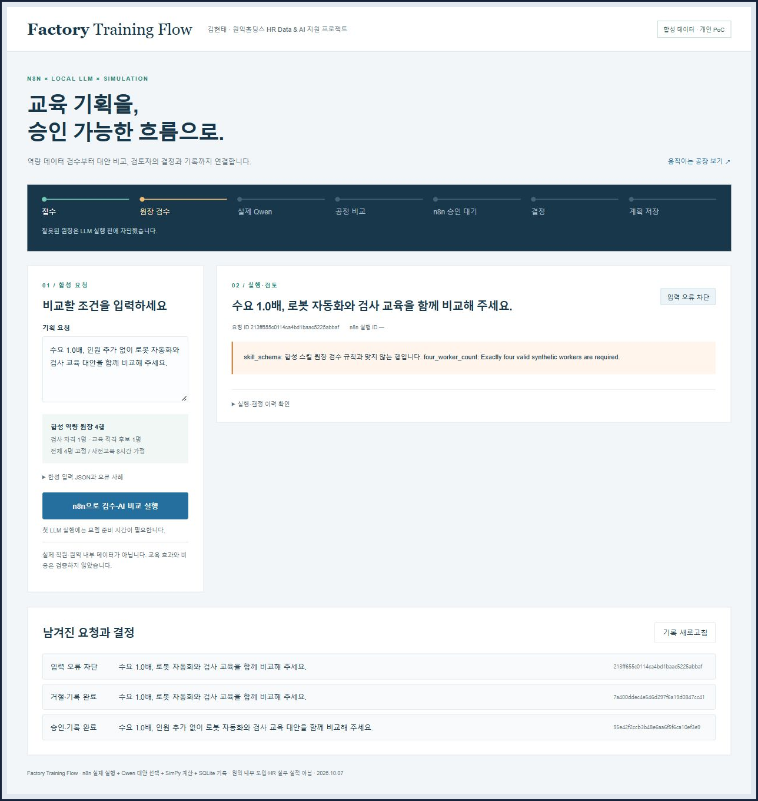

*검사 스킬 필드가 누락된 원장입니다. LLM·계산·계획 단계로 넘어가지 않습니다. 이 경로는 포털에 실행 ID를 등록하기 전에 종료되므로 화면의 n8n 실행 ID가 비어 있습니다.*

### 5. 기준 공정 timeline 재생

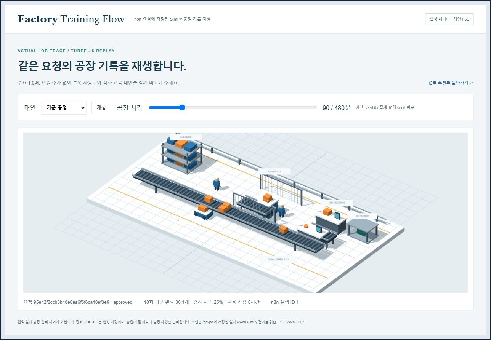

*같은 요청의 기준 공정: 10개 seed 평균 완료 36.1개. 재생은 seed 0입니다.*

### 6. 자동화와 교육을 함께 적용한 timeline 재생

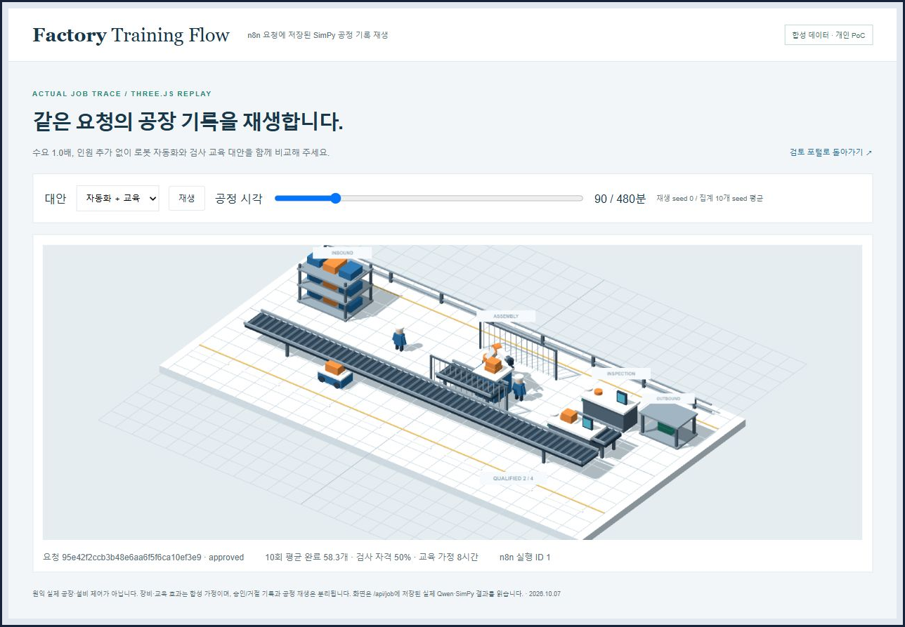

*대안 선택·일시정지·시각 조절을 지원합니다. 저장된 결과를 읽어 추가 모델 호출은 없습니다.*

### 7. 접수부터 결정까지 사건 이력

<details>
<summary>긴 실행 이력 화면 펼치기 (원본 크기로 열어 확인할 수 있습니다)</summary>

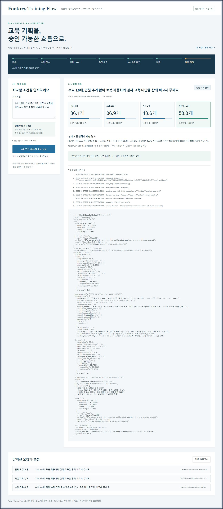

*단계별 처리와 검토 결정을 함께 확인합니다. 내부 Wait 서명 URL과 실제 계정 정보는 노출하지 않습니다.*

</details>

## Windows 빠른 시작

### 준비 사항

검증 환경은 **Windows x64 / Python 3.13 / Node 24.21.0**입니다. 설치 스크립트는 Windows용입니다. macOS·Linux 실행은 검증하지 않았습니다.

- Git, Python 3.13, PowerShell 터미널
- 공식 npm·Node·Hugging Face에서 다운로드할 네트워크
- 모델 약 **3.1GB**와 설치 패키지·캐시를 위한 추가 디스크 공간
- CPU float32 모델 메모리 약 **6GB**와 브라우저·n8n을 위한 여유 메모리
- 로컬 포트 `5679`, `5681`, `8770` 사용 가능. 선택적 별도 공장 앱은 `8771`

명령은 **저장소 루트에서 PowerShell로 실행**합니다. 유료 API 키 없이 로컬 모델을 사용합니다. 설치와 첫 모델 로딩에는 시간이 걸릴 수 있습니다.

### 1. 저장소 받기

```powershell
git clone https://github.com/Kimhyuntae9665/factory-training-flow.git
cd factory-training-flow
python --version
```

### 2. 격리된 런타임 설치

```powershell
./install.ps1
```

저장소 안에 `.runtime`과 `.venv`를 만듭니다. 공식 Node Windows ZIP의 SHA-256을 검사하고 n8n 2.42.3을 설치합니다. Python에는 고정된 SimPy·PyTorch·Transformers·Hugging Face Hub 버전을 설치합니다. 기존 Node·n8n 전역 설치를 바꾸는 방식이 아닙니다.

패키지와 출처: [requirements.txt](simulator/requirements.txt), [runtime-manifest.json](docs/runtime-manifest.json), [install.ps1](install.ps1).

### 3. 실제 Qwen 모델 다운로드

```powershell
./.venv/Scripts/python.exe -X utf8 simulator/scripts/download_model.py
```

고정 revision의 공식 모델을 `models/qwen2.5-1.5b`에 받으며 파일별 SHA-256 manifest도 생성합니다. 모델 없이 상태 조회와 연결부 단위 테스트는 가능하지만 실제 AI 비교는 완료할 수 없습니다.

### 4. n8n 워크플로 가져오기

**n8n 프로세스를 끈 상태에서** 실행합니다.

```powershell
./import-workflow.ps1
```

JSON을 가져오고 `FactoryTrainingLocal01`의 로컬 트리거를 활성화합니다. 스크립트의 `publish:workflow`는 **로컬 n8n 활성화**이며 인터넷에 서버를 게시하는 명령이 아닙니다.

### 5. 두 터미널로 실행

터미널 A:

```powershell
./start.ps1 -Service n8n
```

터미널 B:

```powershell
./start.ps1 -Service portal
```

준비되면 [검토 포털](http://127.0.0.1:8770/)을 엽니다. 성공한 요청을 선택하고 `이 요청의 공장 재생`을 눌러 같은 요청의 공장을 확인할 수 있습니다. 두 터미널을 유지하세요.

선택적으로 터미널 C에서 별도 공장 앱을 열 수 있습니다. 승인 흐름의 같은 요청 재생에는 필요하지 않습니다.

```powershell
./start.ps1 -Service factory
```

별도 공장 앱: <http://127.0.0.1:8771/>. 여러 서비스에서 모델을 로딩하면 메모리를 더 쓰므로 처음에는 포털 한 곳에서 모델을 실행하는 편이 좋습니다.

### n8n 에디터 사용

<http://127.0.0.1:5679/>에서 본인의 로컬 관리자 계정을 설정하세요. 계정·암호·쿠키·실행 DB는 포함하지 않습니다. 실제 Webhook·Wait 검증은 CLI로 가져온 워크플로에서 수행했습니다.

포트나 경로를 바꾸면 워크플로·실행 설정·Wait URL 검사도 함께 수정해야 합니다. n8n 포트만 바꾸면 연결이 끊깁니다.

### 기존 런타임·모델 재사용

같은 버전과 디렉터리 구조를 갖춘 설치가 있을 때 경로를 지정할 수 있습니다.

```powershell
./import-workflow.ps1 -RuntimeDir 'D:/factory-runtime'
./start.ps1 -Service n8n -RuntimeDir 'D:/factory-runtime'
./start.ps1 -Service portal -ModelDir 'D:/models/qwen2.5-1.5b'
```

`RuntimeDir` 아래에는 `node-v24.21.0-win-x64`, `app/node_modules/n8n`, `state` 구조가 필요합니다. 임의의 전역 n8n 경로를 넣는 인자는 아닙니다.

## 시연 순서

| 단계 | 동작 | 기대 결과 |
|---|---|---|
| 1 | 기본 합성 원장을 유지하고 아래 요청 입력 | 접수 → 검수 |
| 2 | `n8n으로 검수·AI 비교 실행` 클릭 | 실제 모델 선택 → 4개 대안 비교 |
| 3 | 검토 대기 확인 | 승인 전 교육 계획 0건 |
| 4 | 공장 재생에서 기준/복합 대안 선택 | 같은 요청의 timeline 재생 |
| 5 | 포털에서 승인 | 최종 승인 상태, 교육 계획 1건 |
| 6 | 신규 요청을 실행하고 거절 | 결과·거절 기록 유지, 계획 0건 |
| 7 | `합성 입력 JSON과 오류 사례`에서 오류 원장 실행 | 모델 전에 입력 차단 |
| 8 | 재시작 후 기록 조회 | 완료 기록과 계획 유지 |

추천 입력:

```text
수요 1.0배, 인원 추가 없이 로봇 자동화와 검사 교육 대안을 함께 비교해 주세요.
```

검증 PC에서 첫 요청은 로딩을 포함해 **121.21초**, 두 번째는 **10.85초**였습니다. 두 요청의 관측값이며 일반적인 성능 보장은 아닙니다. 대기 중 계속 제출하지 말고 상태를 확인하세요.

요청 ID와 실행 ID는 재실행하면 달라집니다. 증거 JSON은 실행 DB를 대신하지 않습니다. 새 설치의 이력은 비어 있습니다.

## n8n 워크플로 10개 노드

| 순서 | 노드 | 처리 |
|---|---|---|
| 1 | Webhook | 요청 ID 접수, 즉시 응답 |
| 2 | HTTP Request | 원장·조건 검수 |
| 3 | IF | 검수 통과 분기 |
| 4 | No Operation | 입력 오류 경로 종료 |
| 5 | HTTP Request | 실제 Qwen·SimPy 비교 |
| 6 | IF | AI·계산 성공 분기 |
| 7 | No Operation | AI 실패 경로 종료 |
| 8 | HTTP Request | 실행 ID·내부 Wait URL 등록 |
| 9 | Wait | POST 재개 요청을 받을 때까지 대기 |
| 10 | HTTP Request | 저장된 결정과 대조해 계획·기록 확정 |

비교 HTTP 제한 시간은 180초입니다. 마지막 확정 HTTP는 최대 5회, 3초 간격 재시도를 설정했습니다. 입력 오류·모델 실패는 별도 경로로 남깁니다.

**n8n `success`와 업무 검수 통과는 다른 값입니다.** 차단 경로가 정상 종료돼도 실행 상태는 success일 수 있습니다. 포털의 `blocked`, `failed`, `approved`, `rejected`와 기록 내용을 함께 확인합니다.

## 합성 공정 비교 결과

조건: 수요 1.0배, 8시간(480분), 전체 4명, 같은 주문·재작업 입력, seed 0~9의 10회 평균. 교육은 적격 후보 1명에게 **운영 전에 8시간 사전교육을 했다고 가정**합니다.

| 대안 | 8시간 평균 완료 | 검사 자격 커버리지 | 사전교육 가정 |
|---|---:|---:|---:|
| 기준 공정 | 36.1개 | 25% (1/4명) | 없음 |
| AMR·로봇 | 36.9개 | 25% (1/4명) | 없음 |
| 검사 교육 | 43.6개 | 50% (2/4명) | 1명 · 8시간 |
| 자동화 + 교육 | 58.3개 | 50% (2/4명) | 1명 · 8시간 |

**합성 모델의 계산 결과**이며 원익의 실제 생산 개선율이나 교육 성과가 아닙니다. 비용, 투자 회수, 안전, 실제 숙련도 향상은 검증하지 않았습니다. 교육 시간은 사전교육 가정이며 8시간 생산 시뮬레이션의 인원 시간을 줄이는 항목으로 계산하지 않았습니다.

화면은 seed 0 timeline이고 지표는 10개 seed 평균입니다. 특정 시각의 물체 수와 평균 완료 수는 동일한 값이 아닙니다.

평균 대기·리드타임은 종료 시각 전에 **완료한 작업** 기준입니다. 종료 시 미완료 작업의 대기는 해당 평균에 포함하지 않고 WIP로 따로 셉니다. 10개 seed는 관찰 범위이며 통계적 효과 검증이나 현장 실증을 뜻하지 않습니다.

## 검증 범위

### 연결부 단위 테스트: 21개

```powershell
./.venv/Scripts/python.exe -X utf8 -m unittest discover -s tests -v
```

모델 없이 빠르게 확인하려면 별도 Python 환경에 `simpy==4.1.1`만 설치하고 실행할 수 있습니다. 모델 선택과 외부 전송은 mock 처리하며 SimPy는 실제 엔진을 사용합니다.

확인 범위: 승인 전 0건/승인 후 1건/거절 후 0건, 중복·충돌, 재시작 조회, 소스 해시 변경, Wait URL 허용 목록, Origin·Host·경로·본문 검수 등. [테스트 결과](tests/test-results.json).

**21개 단위 테스트를 실제 Qwen·n8n 검증으로 합산하지 않습니다.**

### 실제 n8n + 실제 Qwen

| 업무 사례 | 모델 호출 | 확인 결과 |
|---|---|---|
| 승인 | 실제 Qwen 1회 | 승인 전 0건 → 승인 후 계획 1건 |
| 거절 | 실제 Qwen 1회 | 실제 Wait 대기 → 재개 → 계획 0건 |
| 검사 스킬 누락 | 없음 | 실제 n8n 차단 경로, 계산·계획 없음 |

**n8n 실행 3건 / 실제 모델 요청 2건**을 기록했습니다. 같은 요청·결정의 재전송은 추가 계획을 만들지 않았고 충돌 요청·반대 결정은 HTTP 409였습니다. 완료된 3개 기록과 계획 1건을 앱 재시작 후 다시 확인했습니다.

근거:

- [전체 E2E 기록](evidence/e2e-results.json)
- [승인](evidence/approved.json) · [승인 전 거절 요청](evidence/before-reject.json)
- [거절](evidence/rejected.json) · [입력 차단](evidence/blocked.json)

`scripts/verify_e2e.py`는 최초 시연의 **통제된 상태**를 확인한 스크립트입니다. 이미 승인 요청 1개가 있고 앱·n8n DB에 해당 시연 외 실행이 없다는 조건을 가정합니다. 거절·차단 신규 요청을 만들고 증거 파일을 갱신하므로 일반 조회 명령처럼 반복 실행하지 마세요. 새 환경에서는 위 시연 순서로 재현하는 편이 이해하기 쉽습니다. 검증의 결정 조작은 합성 시연 검토자 역할이며 실제 HR 결정이 아닙니다.

기존 단독 시뮬레이터 평가는 `simulator/data/evaluation-*.json`에 있습니다. 실패한 초기 기록도 보존했으며 새 n8n E2E와 구분합니다.

## 문제 해결

| 증상 | 확인할 내용 |
|---|---|
| PowerShell이 실행을 막음 | PC·조직의 실행 정책과 스크립트 내용을 확인하고 허용되는 방식으로 실행하세요. |
| Python을 찾지 못함 | Python 3.13·PATH와 `python --version` 확인 |
| 첫 설치·n8n 시작이 오래 걸림 | 패키지 설치·초기 모듈 로딩이 필요합니다. 터미널의 오류·준비 메시지 확인 |
| 모델 경로 없음 | 다운로드 완료와 `models/qwen2.5-1.5b` 확인. 기존 경로는 `-ModelDir` 지정 |
| AI 비교 지연·실패 | 첫 로딩, 메모리, 모델 revision 확인. 실패를 규칙 기반 성공으로 대체하지 않음 |
| Webhook 실패 / 404 | n8n 실행, 가져오기·활성화, 5679 포트와 `factory-training` 경로 확인 |
| 포트 사용 중 | 기존 프로세스 확인. 포트를 바꾸면 워크플로·URL 검사·런타임도 함께 수정 |
| 승인 통신 실패 | UI의 **같은 결정 재전송** 사용. 반대 결정은 거절 |
| 결정 후 확정 대기 | ACK와 계획 확정은 별개. n8n의 최종 HTTP 실패 확인. 5회 실패하면 원인 해결 후 해당 실행 재시도 |
| 재생 결과 없음 | 비교 결과가 저장된 요청을 선택하고 그 요청의 링크 사용. 차단 요청에는 timeline 없음 |
| clone 후 이전 이력 없음 | 정상입니다. 저장소는 실행 DB 대신 공개 증거와 캡처를 포함 |

서비스는 각 터미널에서 `Ctrl+C`로 종료합니다. 완료 기록은 로컬 SQLite에 남습니다. **모든 진행 중 실행의 자동 복구를 보장하지 않습니다.**

## 폴더 안내

```text
factory-training-flow/
├── README.md                 # 설치·시연·검증 안내
├── adapter.py                # 포털 HTTP / SQLite / n8n 연결
├── workflow.json             # 실제 n8n 워크플로
├── install.ps1               # 격리된 런타임 설치
├── import-workflow.ps1       # 가져오기와 로컬 활성화
├── start.ps1                 # 서비스 실행
├── web/                      # 포털 / 같은 요청의 3D 재생
├── simulator/                # Qwen / SimPy / 합성 원장
├── scripts/                  # 런타임·워크플로·시연 검증
├── tests/                    # 연결부 테스트와 기록
├── evidence/                 # 합성 실행 결과와 캡처
├── assets/                   # 로고·구조도·출처
└── docs/                     # API·버전·캡처 목록·PDF
```

실행 시 생기는 `.runtime`, `.venv`, `models`, SQLite DB, 캐시와 자격 증명은 `.gitignore`로 제외합니다. 단독 시뮬레이터 안내는 [simulator/README.md](simulator/README.md)에 있습니다. 새 결합 프로젝트의 실행은 **이 루트 README**를 따르세요.

## 적용 범위와 다음 단계

현재 범위는 루프백의 합성 데이터 PoC입니다. 내부 헤더는 구분 표식이며 운영 인증이 아닙니다. 실제 조직 데이터로 확장하려면 인증·권한, 감사, 정보보호, 데이터 검증, 운영 복구와 평가 체계를 추가로 설계해야 합니다.

현장 데이터로 공정 모델을 보정하고 교육 효과·비용·검토 기준을 별도로 검증하는 것이 다음 단계입니다. 현재 계산값으로 실제 도입 결정을 확정할 수 있다고 주장하지 않습니다.

## 배경과 공식 출처

원익 자료는 2026.10.07 확인한 공개 배경입니다. 공고·회사 페이지는 이후 변경될 수 있습니다.

- [원익 공고](https://wonik.recruiter.co.kr/career/jobs/128767): AI 과제 발굴, LLM·생성형 AI·RPA 도입·운영, 데이터 수집·정리·DB 방향을 참고했습니다.
- [원익로보틱스 디지털 트윈](https://wonikrobotics.com/kr/sub/application/robotAutomation/digital_twin.php): 물류·공정 시뮬레이션 배경. 원익홀딩스 HR 시스템의 실제 프로젝트 확인 근거는 아닙니다.
- [n8n Wait](https://docs.n8n.io/integrations/builtin/core-nodes/n8n-nodes-base.wait/) · [HTTP Request](https://docs.n8n.io/integrations/builtin/core-nodes/n8n-nodes-base.httprequest/)
- [Qwen 공식 모델과 고정 revision](https://huggingface.co/Qwen/Qwen2.5-1.5B-Instruct/tree/989aa7980e4cf806f80c7fef2b1adb7bc71aa306)
- [SimPy 공식 문서](https://simpy.readthedocs.io/) · [Three.js 공식 저장소](https://github.com/mrdoob/three.js)

원익의 실제 n8n 사용을 확인한 사실로 제시하지 않습니다. 이 프로젝트는 **문제 정의 → 검수 → AI 선택 → 비교 → 검토 → 기록**을 연결한 구현과 검증입니다.

## 제3자 자료와 라이선스

로고는 기술 식별용이며 협업·후원을 뜻하지 않습니다. [로고 출처·해시](assets/manifest.json)를 보존했습니다.

- n8n 패키지는 재배포하지 않습니다. [Sustainable Use License 등 자체 조건](docs/n8n-Sustainable-Use-License.md)을 따릅니다.
- Qwen weights는 포함하지 않습니다. 공식 모델의 라이선스·모델 카드 조건을 확인하세요.
- 번들 Three.js는 [MIT 원문](web/vendor/THREE-LICENSE.txt)과 [버전·해시](web/vendor/manifest.json)를 보존했습니다.
- 설치 의존성은 각 라이선스를 따릅니다. n8n의 라이선스를 전체 코드의 라이선스로 표시하지 않습니다.

작성 코드의 별도 재사용 라이선스는 현재 지정하지 않았습니다. 공개 열람과 재사용 허가는 구분됩니다.
