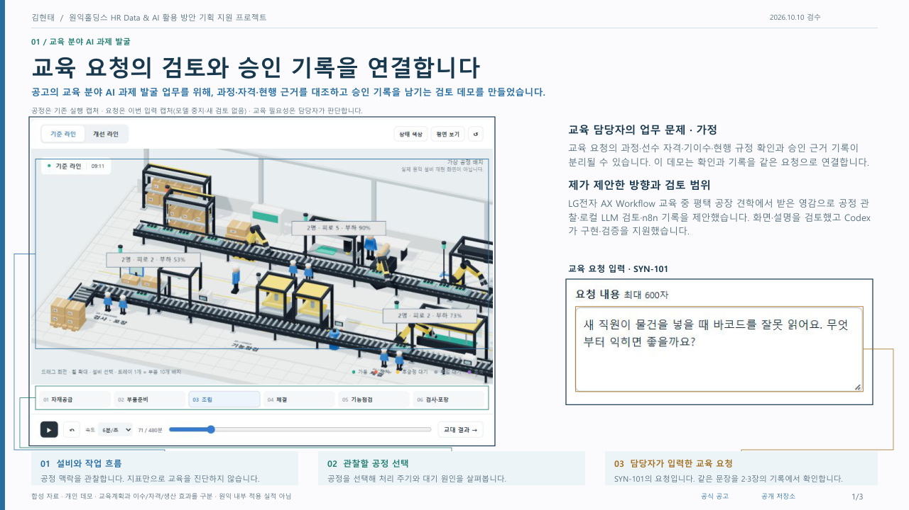
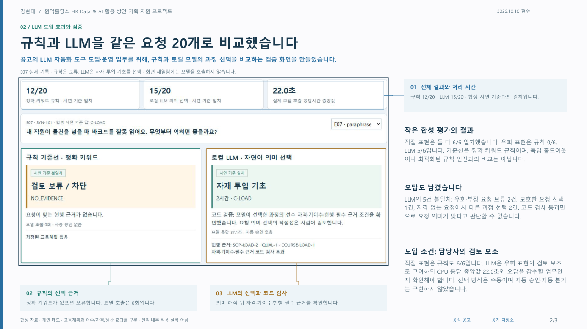
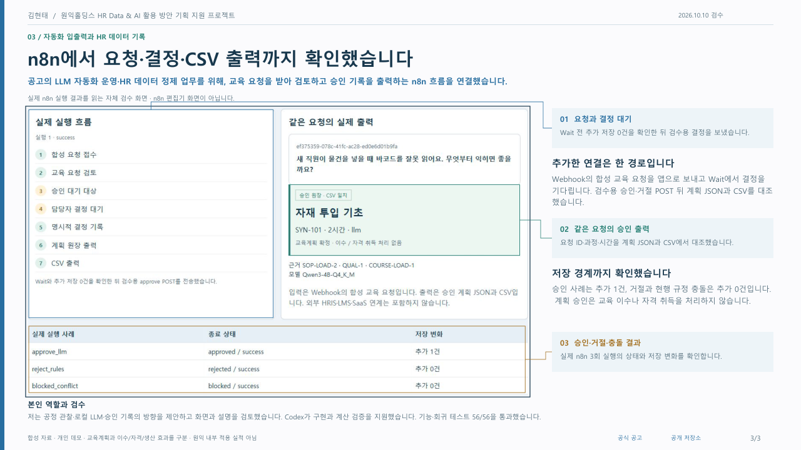

# Wonik Learning Lens

공고의 **교육 분야 AI 과제 발굴·LLM 자동화 도입·HR 데이터 정제** 업무를 위해, 합성 교육 요청을 현행 근거와 대조하고 교육계획을 검토·저장하는 개인 데모를 만들었습니다. 창신 Lean 프로젝트의 Line Lens 공정 화면을 별도 복사해 재사용하고 교육 기능을 추가했습니다.

[3페이지 포트폴리오 v3](portfolio/김현태_원익홀딩스_LearningLens_v3.pdf) · [API와 입출력](docs/learning-api.md) · [재사용·구현 범위](docs/reuse-and-scope.md)

## 최신 실행 화면과 포트폴리오

교육 담당자의 확인·기록 문제와 본인 제안 → 규칙·LLM 비교에 따른 도입 조건 → 실제 n8n 입출력 검증을 총 3페이지로 담았습니다. 업무 문제는 가정이며 회사의 실제 운영 확인 결과가 아닙니다. 기존 실행 증거는 그대로 보존했습니다.

첫 장의 [교육 요청 원본 캡처](../docs/screenshots/wonik-learning-lens-v3/education-request-full.jpg)는 SYN-101/E07 요청을 실제 앱에 입력한 최신 화면입니다. 모델 중지 상태에서 새 검토·승인 없이 촬영했습니다. 공정은 요청 맥락을 관찰하는 참고로, 교육 필요성이나 효과를 자동 계산하지 않습니다.

직접 표현은 두 방식 모두 6/6이므로 규칙을 우선 검토하고, LLM은 우회 표현의 검토 보조로 고려합니다. 약 22초의 CPU 응답과 오답을 담당자가 확인할 수 있는 업무인지 판단해야 하며 자동 방식 분기·자동 승인은 구현하지 않았습니다. [이번 설명 개선 검수](../docs/portfolio-source-v3/revision-validation.json)를 함께 공개합니다.







## 3분 사용

1. `AI 교육계획`에서 합성 작업자, 현행 자료, 선택 방식을 정합니다. 기본값은 로컬 LLM입니다.
2. **규칙 기준선**으로 `자재 투입 교육을 계획해 주세요.`를 검토합니다. 정확 키워드와 자격 조건을 만족하는 과정이 하나이면 모델 호출 없이 승인 대기로 이동합니다. 여러 과정이면 구체적인 요청을 다시 받습니다.
3. **로컬 LLM**으로 `새 직원이 물건을 넣을 때 바코드를 잘못 읽어요. 무엇부터 익히면 좋을까요?`처럼 바꿔 검토합니다. 모든 현행 문서와 수강 가능한 과정 중에서 의미를 해석하며, 모호하거나 무관하면 선택을 보류할 수 있습니다. 코드 검증 통과만으로 요청 의미가 맞았다고 단정하지 않습니다.
4. 과정·시간·현재 자격·SOP·필수 근거를 확인한 뒤 승인 또는 거절합니다. 승인 전 계획은 없고, 승인하면 교육계획만 저장됩니다. 입력을 바꾸면 이전 검토의 승인·거절·근거 다운로드가 해제되어 다시 검토해야 합니다.
5. `자료 없음`·`현행 규정 충돌`을 확인하고 근거 JSON·원장 CSV를 내려받습니다. `새 요청 · 화면 초기화`와 새로고침은 저장된 계획을 보존합니다.

공정 화면에서는 인원·속도·휴식 등을 바꿔 합성 생산·품질·대기를 비교할 수 있습니다. 이 요약은 교육 화면의 읽기 전용 참고이며 교육성과나 교육 추천 점수로 계산하지 않습니다.

## 실행

앱은 npm 외부 의존성 설치 없이 실행합니다. Three.js는 `vendor/`에 포함됩니다. 별도의 llama.cpp 실행 파일과 Qwen3-4B GGUF는 묶음에 포함하지 않습니다.

```powershell
cd <wonik-learning-lens 폴더>
$env:PORT = '8798'
$env:LINE_LENS_LLM_URL = 'http://127.0.0.1:8797/v1'
npm start
```

[앱 열기](http://127.0.0.1:8798). 이번 비교 실행은 localhost CPU 모델, 컨텍스트 3,072, 스레드 2를 사용합니다.

```powershell
llama-server.exe --model <GGUF 경로> --alias Qwen3-4B-Q4_K_M --host 127.0.0.1 --port 8797 --ctx-size 3072 --n-gpu-layers 0 --threads 2 --threads-batch 2 --reasoning off --reasoning-budget 0
```

llama.cpp 빌드의 지원 옵션을 확인하세요. `/v1/models`의 ID는 `Qwen3-4B-Q4_K_M`이어야 합니다. 앱 서버의 코드 기본값은 8786/8787이므로 위 환경변수를 지정합니다. 모델이 없어도 규칙 교육 검토와 공정 계산은 사용할 수 있으며 LLM 요청은 연결 오류를 표시합니다.

## 입력과 출력

| 단계 | 규칙 기준선 `rules` | 로컬 LLM `llm` |
|---|---|---|
| 문서 | 현행 문서의 정확 키워드 검색 | 전체 현행 문서 7개 전달 |
| 과정 | 키워드·선수 자격·기이수·필수 근거를 만족한 과정 | 선수 자격·기이수·필수 근거를 만족한 과정만 enum에 허용 |
| 선택 | 하나면 선택, 여러 개면 재질문, 없으면 차단 | 의미에 따라 `select` / `clarify` / `no_match` |
| 후검증 | 선택 과정의 코드 조건 | 응답 구조·허용 과정·현행 근거·필수 근거를 코드로 다시 확인 |
| 저장 | 별도 승인 이후 교육계획 | 별도 승인 이후 교육계획 |

현행 자료 충돌 또는 수강 가능한 과정 없음은 모델 호출 전에 차단합니다. 코드가 확인하는 조건과 모델의 의미 선택을 분리하며, 화면의 고정 설명은 **코드 검증 결과**입니다. 임베딩·벡터 검색은 없습니다. 작은 문서 묶음을 전체 전달하는 구현입니다.

`.learning-state.json`은 **파일 원장**입니다. 데이터베이스가 아니며 단일 앱 프로세스 안의 잠금과 임시 파일 후 rename으로 저장합니다. 계획에는 과정·근거·`selectionMode`·`modelId`가 남습니다. 같은 결정의 재전송은 중복 계획을 만들지 않고 반대 결정은 409입니다.

## 실제 n8n 입출력 경로

`workflow-learning.json`의 흐름은 `POST Webhook → 교육 요청 검토 → IF → Wait → 명시적 결정 → 계획 JSON → CSV`입니다. 차단 결과는 Wait·결정·원장 출력·CSV 없이 종료합니다. 검증 권한은 앱 API에 있으며 n8n은 입력·대기·출력을 연결합니다.

준비된 별도 런타임과 **새 작업 폴더**를 지정합니다. 앱을 시작하기 전에 `$env:LEARNING_STATE_PATH`를 새 빈 원장 경로로 정해 기존 계획을 보존하세요.

```powershell
# 앱 시작 전, 새 검증에 사용할 빈 파일 경로 지정
$env:LEARNING_STATE_PATH = '<새 작업 폴더>/app-state.json'
# 위 실행 절의 환경변수와 npm start로 앱을 시작한 뒤 별도 터미널에서 실행
.\scripts\n8n-start.ps1 -InstallDir '<준비한 n8n 런타임 폴더>' -RunDir '<새 작업 폴더>'
python -X utf8 .\scripts\n8n-verify.py --db '<새 작업 폴더>/n8n-state/.n8n/database.sqlite' --out '<새 결과 폴더>'
```

`InstallDir` 아래에는 `node-v24.21.0-win-x64/node.exe`와 `app/node_modules/n8n/bin/n8n`(2.42.3)이 있어야 합니다. 이 런타임과 Python은 별도로 준비하며 저장소에 포함하지 않습니다. 경로의 `<…>`는 실제 경로로 바꿉니다.

시작 스크립트는 준비된 작업용 Node 24.21.0/n8n 설치를 사용합니다. 기본 설치 경로는 작업 루트의 `work/n8n-runtime`, 상태·로그 경로는 `work/wonik-v3-runtime`이며 `-InstallDir`, `-RunDir`로 바꿀 수 있습니다. `-ImportOnly`도 가져오기와 **로컬 publish**까지 수행하고 서버 시작을 생략합니다. n8n은 127.0.0.1:5697, broker는 5698을 사용하며 기존 포트가 사용 중이면 중단합니다.

검증 스크립트는 앱 8798/n8n 5697과 빈 앱 원장을 전제로 합니다. `--db`는 n8n 실행 DB 경로, `--out`은 새 실행 상세·CSV 저장 경로입니다. 새 결과 요약은 그 폴더의 `results.json`에 저장하고 trace·CSV 이름은 그 폴더를 기준으로 읽습니다. 기본 출력도 시각이 붙은 새 폴더여서 공개된 2026-10-10 증거를 덮어쓰지 않습니다. 게시 준비에서 출력 경로 처리만 보완하고 Python 문법을 확인했으며 이 변경 후 n8n을 추가 실행하지 않았습니다. 앱 검증 경로의 승인·거절 POST는 **명시적인 합성 테스트 결정**으로 실제 담당자의 클릭이 아닙니다. 테스트는 이 워크플로의 실행 메타데이터·노드 출력만 읽고 Wait 전 계획 없음, 승인 1건·거절 0건, 충돌 무호출, JSON/CSV 일치를 확인합니다.

[실행 증거 JSON](evidence/n8n-20261010.json)의 `passed`, `cases[].checks`, execution ID와 상세 trace를 함께 확인하세요. 프로젝트의 실행 증거 뷰어는 자체 작성 화면이며 n8n 편집기 UI가 아닙니다. 같은 PC의 loopback 연결만 대상으로 했으며 Docker·별도 호스트·사내 인증·운영 배포는 검증 범위에 포함하지 않습니다.

2026-10-10 실제 n8n 2.42.3 실행 **3건 모두 success**를 확인했습니다. 정상 승인·거절 경로는 각각 7개 노드를 실행했습니다.

| 합성 사례 | 확인된 동작 | 해당 요청의 새 계획 |
|---|---|---|
| `approve_llm` | Wait 전 계획 없음 → 명시적 승인 POST → 계획 JSON·CSV 출력 | +1건 |
| `reject_rules` | Wait 전 새 계획 없음 → 명시적 거절 POST → 계획 JSON·CSV 출력 | +0건 |
| `blocked_conflict` | Wait·모델·결정·CSV 실행 없이 차단 종료 | +0건 |

계획 JSON은 앱 원장과 일치했습니다. n8n HTTP 텍스트 출력은 API CSV의 UTF-8 BOM을 제거했으므로 CSV는 **선택적인 맨 앞 BOM만 제외하고** 본문·행을 대조했습니다. `transportMetadata.csv_bom_preserved:false`와 비교 규칙을 증거에 남겼으며 원본 출력 CSV는 그대로 보존했습니다. 이는 자동 승인이나 실제 직원 승인 실적이 아닙니다.

## 비교와 검증 근거

[20개 합성 요청의 비교 결과](evidence/comparison-20261010-final/results.json)는 동일 요청을 두 방식으로 평가합니다. 정답은 개발자가 작성한 라벨이며 현업 담당자 정답이나 독립 홀드아웃이 아닙니다. 규칙 기준선은 고정 키워드 구현이며 최적화한 규칙 전체를 대표하지 않습니다. 이 결과를 일반 정확도 차이로 확대하지 않습니다.

결과의 `completedAt`과 `summary`가 있을 때 각 방식의 20건 완료 여부, 오류, 정답 라벨 일치, 실제 모델 호출 수를 확인합니다. `results`에는 요청별 응답과 필수 근거 검증이 남습니다. 코드·자료·문항 해시와 실행 호스트도 확인할 수 있습니다. 중간 저장 파일의 일부 행으로 최종 비율을 계산하지 않습니다. 의미 선택의 오답과 규정 검증 통과는 서로 다른 결과입니다.

2026-10-10 완료된 40개 실행의 관측 결과:

| 방식 | 개발자 라벨 일치 | 실제 모델 호출 | 모델 응답시간 중앙값 |
|---|---|---|---|
| 정확 키워드 규칙 | 12/20 | 0 | 해당 없음 |
| 로컬 Qwen3-4B | 15/20 | 18 | 21,952ms |

두 방식 모두 실행 오류와 선택된 필수 근거 오류는 0건이었습니다. 그러나 LLM은 E11·E13에서 필요한 과정을 보류했고, E15의 모호한 요청을 임의 선택했습니다. E16·E17은 요청한 과정의 자격이 없는데 다른 허용 과정을 선택했습니다. **코드상 수강 가능과 요청 의미의 적합성은 다르므로 승인 전 사람의 검토가 필요합니다.** 이 결과는 위 20개 합성 요청과 해당 CPU 실행 조건에 한정됩니다.

```powershell
npm test
node --test --test-name-pattern='UI:' tests/learning.test.mjs
$env:LINE_LENS_LLM_URL = 'http://127.0.0.1:8797/v1'
$env:EVAL_OUT = '<새 결과 폴더>'
node evaluation/evaluate.mjs
```

평가 기본 출력은 `evidence/comparison-20261010-final`입니다. 새 폴더를 지정하면 기존 결과를 보존합니다. 기본은 전체 20문항의 `rules,llm` 실행이며 `EVAL_IDS`, `EVAL_MODES`로 선택할 수 있습니다. Mock 테스트는 구조·자격·근거·중복 결정·저장·오류·입력 변경을 확인하며 실제 모델 정확도나 브라우저 렌더링의 증거로 대신하지 않습니다. 최신 통합 검수는 [validation-v3.json](evidence/validation-v3.json), 이전 [브라우저 검수 기록](evidence/live-validation.json)은 기록 당시 실행에 관한 자료입니다.

2026-10-10 자동 회귀는 **56/56 통과**했습니다. [원본 테스트 로그](evidence/tests-20261010.txt)를 묶음에 포함했습니다. 이 통과 결과도 위 의미 선택 오답을 없애는 근거는 아닙니다.

## 출처와 한계

모든 공정·인력·SOP·교육과정은 합성입니다. 원익 내부 자료, 실제 공장을 연결·보정한 디지털 트윈, 회사 운영 실적이 아닙니다. 승인은 이수·자격 취득·생산량 효과를 부여하지 않습니다. 실제 LMS·HR DB와 운영 권한·인증·개인정보 처리·현업 검증은 별도 확인이 필요합니다.

[원익그룹 공식 공고](https://wonik.recruiter.co.kr/career/jobs/128767)의 HR Data & AI 활용 방안 기획 업무를 바탕으로 제작했습니다. 공고 확인 기록은 2026-10-09 기준입니다. [원익로보틱스 디지털 트윈](https://wonikrobotics.com/kr/sub/application/robotAutomation/digital_twin.php)은 계열사 제조 시뮬레이션 사업 배경이며 해당 HR 조직의 내부 도구 확인 근거는 아닙니다.
